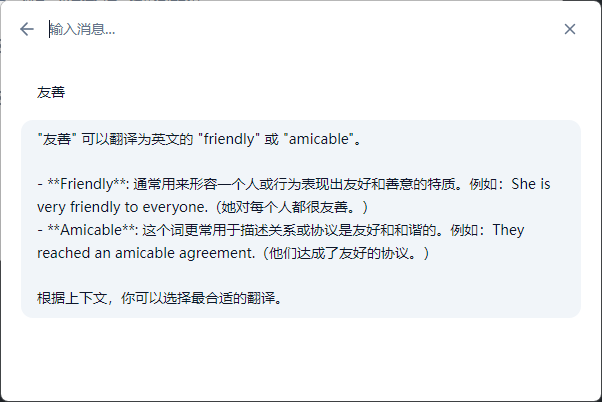

# echo - 智能对话助手

    

echo 是一个基于 Tauri + React 开发的跨平台智能对话助手应用。它提供了一个简洁优雅的界面，让你可以轻松地与各种 AI 模型进行对话。

## ✨ 主要特性

- 🤖 支持多种 AI 模型接入
- 💬 流式输出的对话体验
- 🔥 便捷的快捷键呼出 (Alt + Space)
- 🎯 系统托盘常驻
- 🔄 自动更新功能
- 📝 聊天历史记录
- 🎨 现代化 UI 界面
- 🔌 可扩展的机器人系统
- 🛠 丰富的设置选项

## 📸 界面预览

    

    

## 🚀 快速开始

### 系统要求

- Windows 10 及以上

### 安装方式

1. 从 [Releases](https://github.com/yourusername/echo/releases) 页面下载最新版安装包
2. 运行安装程序
3. 启动应用即可开始使用

## 🔧 配置说明

- 在设置界面中可以配置 AI 模型参数
- 支持自定义系统提示词
- 可以添加和管理多个机器人
- 支持开机自启动设置

## 🤝 贡献指南

欢迎提交 Issue 和 Pull Request 来帮助改进这个项目。

## 📄 许可证

本项目采用 MIT 许可证 - 查看 [LICENSE](LICENSE) 文件了解详情。
