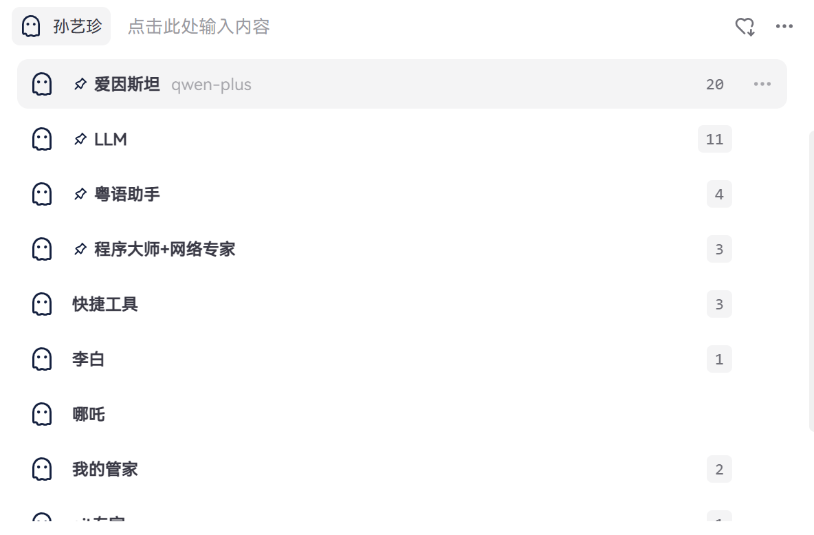
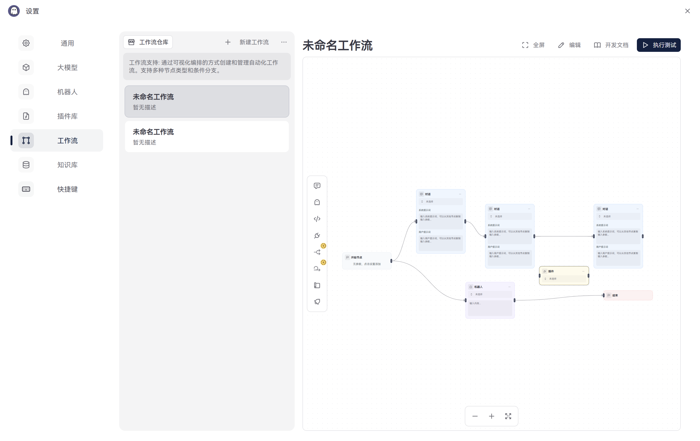
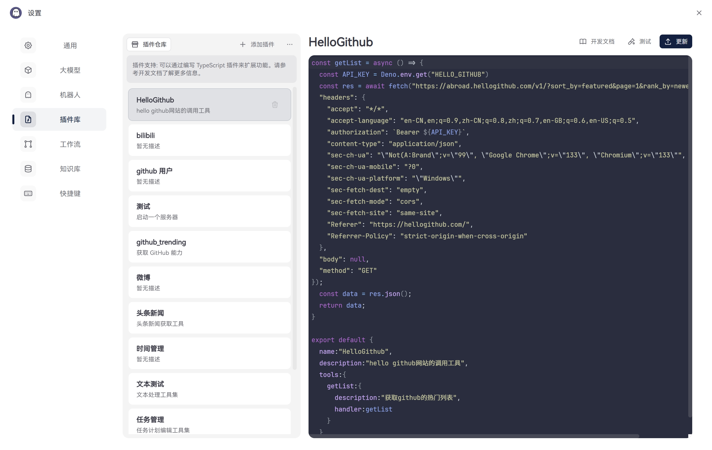

# ghostie Intelligent Assistant

<div align="center">
    
</div>
[ghostie](https://ghostie.wangenius.com) is a cross-platform intelligent assistant application developed based on Tauri + React. It provides a simple and elegant interface, allowing you to easily interact with various AI models.

[Tutorial](https://ghostie.wangenius.com) [Examples](https://ghostie.wangenius.com)

## ✨ Key Features

### 🤖 AI & Agent System

- Support for multiple AI models (OpenAI, Tongyi, etc.)
- Multi-agent system with different roles and capabilities
- Intelligent context management and conversation flow
- Customizable agent personalities and behaviors
- Agent collaboration and task delegation

### 🌐 MCP Support

- MCP market: open with one click
- more from other source

### 💻 Desktop Integration

- Full desktop system access and control
- Local script execution without MCP server
- System-level automation capabilities
- Native file system integration
- Cross-platform support (Windows, macOS, Linux, Current in Windows)

### 🔌 Plugin Architecture

- Extensible plugin system
- Custom plugin development support
- Plugin marketplace
- Plugin hot-reload capability
- Plugin permission management

### ⚡ Workflow Engine

- Visual workflow designer
- Multi-agent workflow orchestration
- Conditional branching and loops
- Error handling and recovery
- Workflow templates and sharing

### 📚 Knowledge Management

- Local knowledge base support
- Document parsing and indexing
- Multi-format support (PDF, Word, Markdown, TXT)
- Knowledge base search and filtering
- Knowledge sharing and collaboration

### 🎯 User Experience

- Quick shortcut activation (Alt + Space)
- Modern UI based on Tailwind CSS
- Automatic updates
- Cross-platform consistency
- Full-stack TypeScript development

## 📸 Interface Preview

<div align="center">
    
</div>

<div align="center">
    
</div>

<div align="center">
    
</div>

<div align="center">
    
</div>

## 🚀 Quick Start

### System Requirements

- Windows 10 or above
- macOS or Linux (coming soon)

## 📖 User Guide

### Basic Usage

1. **Quick Launch**

   - Use shortcut `Alt + Space` to summon the assistant window anytime
     - Window appears elegantly in the center of the screen
     - Supports automatic window position memory
     - Customizable shortcut combinations in settings

2. **Conversation Interaction**

   - Input Features
     - Multi-line input support (Shift + Enter for new line)
     - Automatic code block recognition and formatting
     - `Ctrl + L` shortcut to clear input
     - Up/down arrow keys for quick history access
   - Conversation Features
     - Markdown format display support
     - One-click code block copying
   - Context Management
     - Automatic conversation context maintenance
     - Manual context clearing (`Ctrl + R`)
     - Fixed context settings support
     - Smart context length adjustment

3. **Assistant Switching**
   - Preset Assistant Types
     - General Assistant: Daily conversations and Q&A
     - Code Assistant: Programming-related queries
     - Writing Assistant: Content creation
     - Analysis Assistant: Data analysis and processing
   - Custom Assistants
     - Create in Settings > Assistant Management
     - Import/export assistant configurations
     - Clone existing assistants
     - Custom assistant icons and styles

### Advanced Features

1. **Knowledge Base Management**

   - Document Support
     - Supported formats: PDF, Word, Markdown, TXT
     - Automatic document parsing and indexing
     - Batch folder import support
     - Automatic document synchronization
   - Knowledge Base Operations
     - Create multiple knowledge base groups
     - Knowledge base search and filtering
     - Knowledge base merging support
     - Import/export functionality
   - Q&A Features
     - Precise Q&A based on knowledge base
     - Multi-knowledge base joint query support
     - Adjustable relevance threshold
     - Answer source tracing

2. **Workflow Automation**

   - Workflow Creation
     - Visual workflow editor
     - Conditional branching and loops
     - Multiple action node combinations
     - Error handling and retry mechanisms
   - Trigger Conditions
     - Scheduled triggers
     - Event triggers
     - Message triggers
     - API triggers
   - Execution Control
     - Parallel/sequential execution control
     - Execution status monitoring
     - Log recording and tracking
     - Execution result notifications

3. **History and Export**
   - History Management
     - View by date/assistant category
     - Full-text search support
     - Tag management system
     - Important conversation starring
   - Export Features
     - Markdown format export
     - HTML webpage export
     - PDF document export
     - Batch export functionality

## 💡 Core Features

### ChatModel

- Support for multiple model integrations (OpenAI, Azure, etc.)
- Intelligent context management
- Custom model parameter configuration
- Complete conversation history
- Streaming output support

### Agent/Agent/Proxy/Assistant

- Configurable conversation strategies
- Multi-assistant switching
- Workflow and plugin support
- Knowledge base integration
- Assistant personalization settings

### Workflow

- Custom workflow support
- Task chain processing
- Multi-agent collaboration
- Extensible plugin system

### MCP (Multi-Cloud Platform)

- 地理位置服务（地址解析、地点搜索、天气查询）
- 路线规划与导航服务（驾车、步行、公交、骑行）
- IP定位服务
- 距离测量与周边搜索
- 可扩展的API集成框架

## ⚙️ Development Setup

```bash
# Install dependencies
npm install

# Run in development mode
npm run tauri dev

# Build application
npm run build:tauri
```

## 🤝 Contributing

1. Fork this repository
2. Create your feature branch (`git checkout -b feature/AmazingFeature`)
3. Commit your changes (`git commit -m 'Add some AmazingFeature'`)
4. Push to the branch (`git push origin feature/AmazingFeature`)
5. Open a Pull Request

## 📄 License

This project is licensed under the MIT License - see the [LICENSE](LICENSE) file for details.

## 🙏 Acknowledgments

- [Tauri](https://tauri.app/)
- [React](https://reactjs.org/)
- All contributors and users
