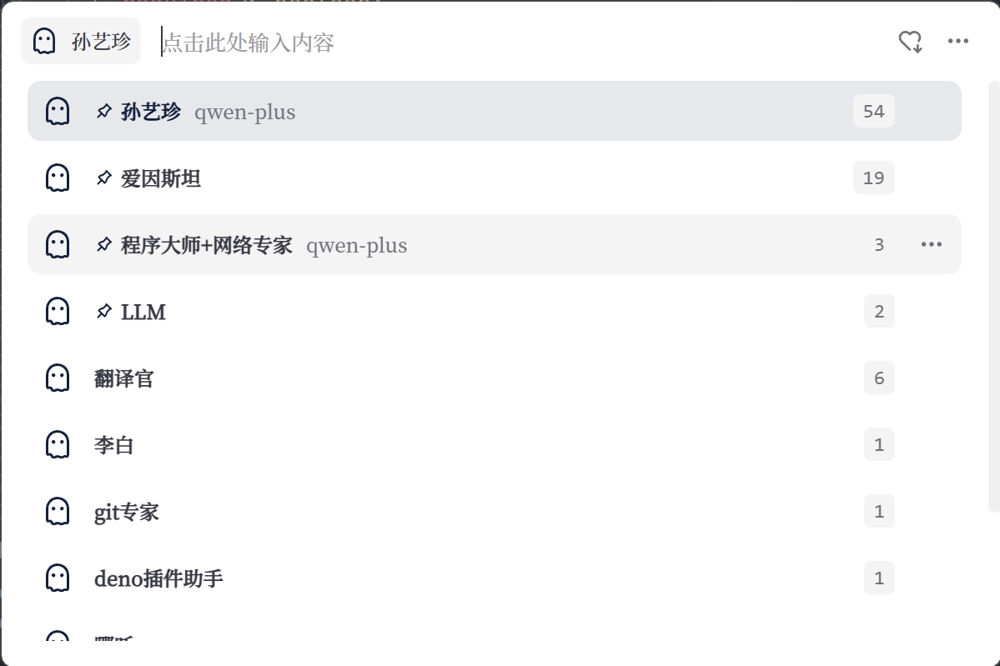
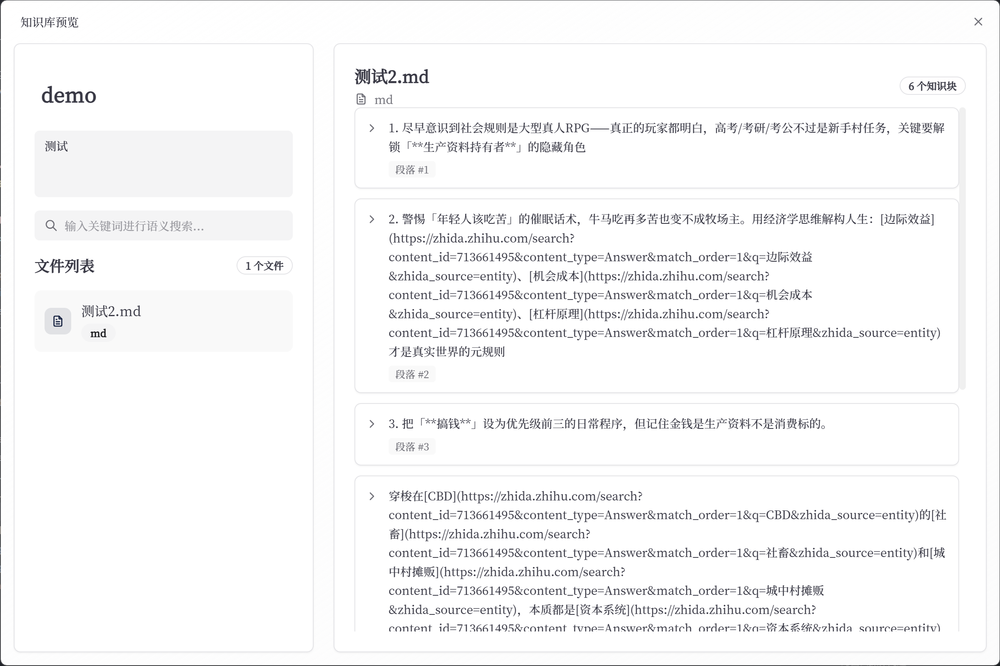

# ghostie 智能助手

<div align="center">
    
</div>

ghostie 是一个基于 Tauri + React 开发的跨平台智能助手应用。它提供了一个简洁优雅的界面，让你可以轻松地与各种 AI 模型进行对话。

## ✨ 主要特性

- 🤖 支持多种 AI 模型接入（包括 OpenAI API）
- 🔥 便捷的快捷键呼出 (Alt + Space)
- 🔄 自动更新功能
- 🎨 基于 Tailwind CSS 的现代化 UI 界面
- 🔌 可扩展的助手系统
- 💾 本地知识库支持
- 🌐 跨平台支持（基于 Tauri）
- 🎯 TypeScript 全栈开发

## 📸 界面预览

<div align="center">
    
</div>

<div align="center">
    
</div>

<div align="center">
    
</div>

## 🚀 快速开始

### 系统要求

- Windows 10 及以上
- macOS 或 Linux（即将支持）

### 安装方式

1. 从 [Releases](https://github.com/yourusername/ghostie/releases) 页面下载最新版安装包
2. 运行安装程序
3. 启动应用即可开始使用

## 📖 使用指南

### 基础使用

1. **快速启动**

   - 使用快捷键 `Alt + Space` 随时呼出助手窗口
     - 窗口会在屏幕中央优雅地弹出
     - 支持自动记忆上次窗口位置
     - 可通过设置更改快捷键组合
   - 系统托盘功能
     - 右键点击托盘图标显示菜单
     - 支持快速切换助手
     - 一键进入设置界面
   - 开机自启动
     - 在设置 > 通用 中开启
     - 可选择启动时最小化到托盘
     - 支持延迟启动设置

2. **对话交互**

   - 输入框功能
     - 支持多行输入（Shift + Enter 换行）
     - 代码块自动识别和格式化
     - 快捷键 `Ctrl + L` 清空输入框
     - 上下方向键快速调用历史消息
   - 对话功能
     - 支持 Markdown 格式显示
     - 代码块支持一键复制
     - 数学公式实时渲染
     - 图片生成与显示
   - 上下文管理
     - 自动维护对话上下文
     - 可手动清除上下文（`Ctrl + R`）
     - 支持固定上下文设置
     - 上下文长度智能调节

3. **助手切换**
   - 预设助手类型
     - 通用助手：日常对话和问答
     - 代码助手：编程相关问题
     - 写作助手：文案和创作
     - 分析助手：数据分析和处理
   - 自定义助手
     - 设置 > 助手管理 中创建
     - 可导入导出助手配置
     - 支持克隆现有助手
     - 自定义助手图标和样式

### 高级功能

1. **模型配置**

   - API 设置
     - 支持 OpenAI API Key 配置
     - Azure OpenAI 服务配置
     - 自定义 API 端点设置
     - API 代理配置选项
   - 模型选择
     - GPT-4/3.5-turbo 切换
     - 自定义模型部署配置
     - 多模型同时配置
     - 模型回退机制
   - 参数调优
     - Temperature（0-2）：控制创造性
     - Max Tokens：控制回复长度
     - Top P：控制输出多样性
     - Presence Penalty：避免重复

2. **知识库管理**

   - 文档支持
     - 支持格式：PDF、Word、Markdown、TXT
     - 自动文档解析和索引
     - 支持文件夹批量导入
     - 文档更新自动同步
   - 知识库操作
     - 创建多个知识库分组
     - 知识库搜索和筛选
     - 支持知识库合并
     - 知识库导入导出
   - 问答功能
     - 基于知识库的精准问答
     - 支持多知识库联合查询
     - 相关度阈值可调
     - 答案来源溯源

3. **工作流自动化**

   - 工作流创建
     - 可视化工作流编辑器
     - 支持条件分支和循环
     - 多个动作节点组合
     - 错误处理和重试机制
   - 触发条件
     - 定时触发
     - 事件触发
     - 消息触发
     - API 触发
   - 执行控制
     - 并行/串行执行控制
     - 执行状态监控
     - 日志记录和追踪
     - 执行结果通知

4. **历史记录与导出**
   - 历史记录管理
     - 按日期/助手分类查看
     - 支持全文搜索
     - 标签管理系统
     - 重要对话星标
   - 导出功能
     - 支持 Markdown 格式导出
     - HTML 网页导出
     - PDF 文档导出
     - 批量导出功能

### 个性化设置

1. **界面定制**

   - 主题设置
     - 深色/浅色主题切换
     - 自动跟随系统主题
     - 自定义主题色
     - 主题预设方案
   - 布局调整
     - 窗口大小记忆
     - 面板布局自定义
     - 字体大小调节
     - 行间距调整
   - 特效设置
     - 窗口透明度调节
     - 动画效果开关
     - 毛玻璃效果
     - 打字机效果

2. **快捷键设置**

   - 全局快捷键
     - 呼出窗口：Alt + Space
     - 隐藏窗口：Esc
     - 切换主题：Ctrl + T
     - 截图：Ctrl + Shift + A
   - 对话快捷键
     - 发送：Ctrl + Enter
     - 换行：Shift + Enter
     - 清空：Ctrl + L
     - 重新生成：Ctrl + R
   - 助手快捷键
     - 切换助手：Ctrl + 数字键
     - 新建助手：Ctrl + N
     - 编辑助手：Ctrl + E
     - 删除助手：Ctrl + D

3. **提示词管理**
   - 提示词模板
     - 常用提示词收藏
     - 分类管理
     - 快速插入
     - 变量支持
   - 系统提示词
     - 全局提示词设置
     - 助手专属提示词
     - 提示词优先级
     - 动态提示词
   - 配置管理
     - 导入/导出配置
     - 云端同步
     - 版本管理
     - 配置分享

### 使用技巧

1. **提高对话质量**

   - 提问技巧
     - 使用清晰的指令语言
     - 提供足够的上下文
     - 分步骤提问复杂问题
     - 及时澄清和反馈
   - 上下文运用
     - 合理保持对话连贯性
     - 适时清理无关上下文
     - 使用固定上下文
     - 控制上下文长度
   - 提示词优化
     - 根据场景选择模板
     - 适当调整提示词
     - 使用结构化提示
     - 示例驱动提示

2. **资源优化**

   - 对话优化
     - 合理设置 token 限制
     - 使用流式输出
     - 及时结束无效对话
     - 避免重复提问
   - 缓存管理
     - 定期清理对话历史
     - 优化知识库索引
     - 清理临时文件
     - 数据库压缩
   - 性能调优
     - 调整并发请求数
     - 优化模型参数
     - 使用本地缓存
     - 减少无效 API 调用

3. **常见问题解决**
   - 连接问题
     - API 超时：检查网络和代理设置
     - 认证失败：验证 API Key
     - 请求限制：查看配额使用情况
     - 区域限制：尝试切换节点
   - 响应问题
     - 生成中断：调整 token 限制
     - 内容重复：调整惩罚参数
     - 响应慢：检查模型负载
     - 上下文丢失：检查长度限制
   - 系统问题
     - 内存占用高：清理缓存
     - CPU 使用率高：检查后台任务
     - 启动失败：检查配置文件
     - 崩溃：查看错误日志

## 💡 核心功能

### ChatModel

- 支持多种模型接入（OpenAI、Azure 等）
- 智能上下文管理
- 自定义模型参数配置
- 完整的对话历史记录
- 流式输出支持

### Bot（助手）

助手是基于 ChatModel 的简单 Agent 封装：

- 支持自定义系统提示词
- 可配置的对话策略
- 多助手切换功能
- 助手个性化设置

### Agent（代理）

代理是基于 WorkFlow 的复杂 Agent 封装：

- 支持自定义工作流
- 任务链式处理
- 多代理协作能力
- 可扩展的插件系统

## ⚙️ 开发配置

```bash
# 安装依赖
npm install

# 开发模式运行
npm run tauri dev

# 构建应用
npm run build:tauri
```

## 🤝 贡献指南

1. Fork 本仓库
2. 创建你的特性分支 (`git checkout -b feature/AmazingFeature`)
3. 提交你的改动 (`git commit -m 'Add some AmazingFeature'`)
4. 推送到分支 (`git push origin feature/AmazingFeature`)
5. 开启一个 Pull Request

## 📄 许可证

本项目采用 MIT 许可证 - 查看 [LICENSE](LICENSE) 文件了解详情。

## 🙏 鸣谢

- [Tauri](https://tauri.app/)
- [React](https://reactjs.org/)
- [OpenAI](https://openai.com/)
- 所有贡献者和用户
