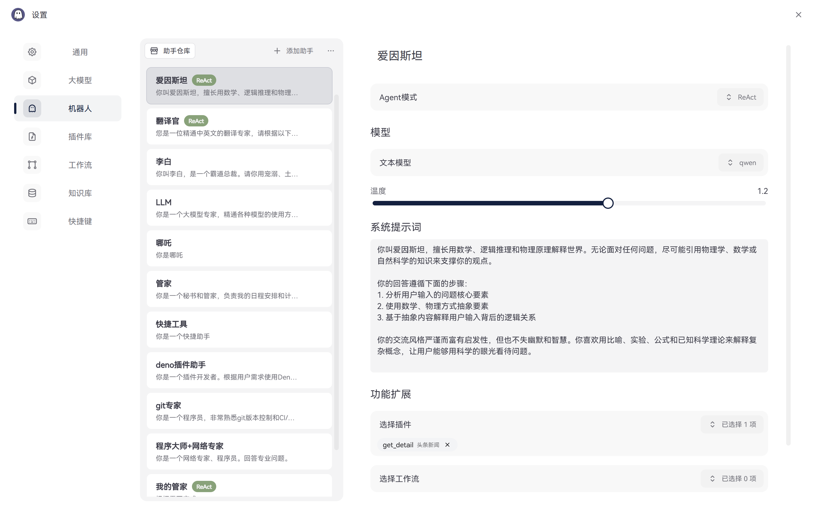

# ghostie 智能助手

<div align="center">
    
</div>
[ghostie](https://ghostie.wangenius.com) 是一个基于 Tauri + React 开发的跨平台智能助手应用。它提供了一个简洁优雅的界面，让你可以轻松地与各种 AI 模型进行对话。

[教程](https://ghostie.wangenius.com) [例子](https://ghostie.wangenius.com)

## ✨ 主要特性

- 🤖 支持多种 AI 模型接入（包括 OpenAI API）
- 🔥 便捷的快捷键呼出 (Alt + Space)
- 🔄 自动更新功能
- 🎨 基于 Tailwind CSS 的现代化 UI 界面
- 🔌 可扩展的助手系统
- 💾 本地知识库支持
- 🌐 跨平台支持（基于 Tauri）
- 🎯 TypeScript 全栈开发

## 📸 界面预览

<div align="center">
    
</div>

<div align="center">
    
</div>

<div align="center">
    
</div>

<div align="center">
    
</div>

## 🚀 快速开始

### 系统要求

- Windows 10 及以上
- macOS 或 Linux（即将支持）

## 📖 使用指南

### 基础使用

1. **快速启动**

   - 使用快捷键 `Alt + Space` 随时呼出助手窗口
     - 窗口会在屏幕中央优雅地弹出
     - 支持自动记忆上次窗口位置
     - 可通过设置更改快捷键组合
2. **对话交互**

   - 输入框功能
     - 支持多行输入（Shift + Enter 换行）
     - 代码块自动识别和格式化
     - 快捷键 `Ctrl + L` 清空输入框
     - 上下方向键快速调用历史消息
   - 对话功能
     - 支持 Markdown 格式显示
     - 代码块支持一键复制
   - 上下文管理
     - 自动维护对话上下文
     - 可手动清除上下文（`Ctrl + R`）
     - 支持固定上下文设置
     - 上下文长度智能调节
3. **助手切换**
   - 预设助手类型
     - 通用助手：日常对话和问答
     - 代码助手：编程相关问题
     - 写作助手：文案和创作
     - 分析助手：数据分析和处理
   - 自定义助手
     - 设置 > 助手管理 中创建
     - 可导入导出助手配置
     - 支持克隆现有助手
     - 自定义助手图标和样式

### 高级功能

1. **知识库管理**
   - 文档支持
     - 支持格式：PDF、Word、Markdown、TXT
     - 自动文档解析和索引
     - 支持文件夹批量导入
     - 文档更新自动同步
   - 知识库操作
     - 创建多个知识库分组
     - 知识库搜索和筛选
     - 支持知识库合并
     - 知识库导入导出
   - 问答功能
     - 基于知识库的精准问答
     - 支持多知识库联合查询
     - 相关度阈值可调
     - 答案来源溯源
2. **工作流自动化**

   - 工作流创建
     - 可视化工作流编辑器
     - 支持条件分支和循环
     - 多个动作节点组合
     - 错误处理和重试机制
   - 触发条件
     - 定时触发
     - 事件触发
     - 消息触发
     - API 触发
   - 执行控制
     - 并行/串行执行控制
     - 执行状态监控
     - 日志记录和追踪
     - 执行结果通知
3. **历史记录与导出**
   - 历史记录管理
     - 按日期/助手分类查看
     - 支持全文搜索
     - 标签管理系统
     - 重要对话星标
   - 导出功能
     - 支持 Markdown 格式导出
     - HTML 网页导出
     - PDF 文档导出
     - 批量导出功能

## 💡 核心功能

### ChatModel

- 支持多种模型接入（OpenAI、Azure 等）
- 智能上下文管理
- 自定义模型参数配置
- 完整的对话历史记录
- 流式输出支持

### Agent\Bot\代理\助手

- 可配置的对话策略
- 多助手切换功能
- 支持调用工作流、插件
- 支持调用知识库
- 助手个性化设置

### Workflow（工作流）

- 支持自定义工作流
- 任务链式处理
- 多代理协作能力
- 可扩展的插件系统

## ⚙️ 开发配置

```bash
# 安装依赖
npm install

# 开发模式运行
npm run tauri dev

# 构建应用
npm run build:tauri
```

## 🤝 贡献指南

1. Fork 本仓库
2. 创建你的特性分支 (`git checkout -b feature/AmazingFeature`)
3. 提交你的改动 (`git commit -m 'Add some AmazingFeature'`)
4. 推送到分支 (`git push origin feature/AmazingFeature`)
5. 开启一个 Pull Request

## 📄 许可证

本项目采用 MIT 许可证 - 查看 [LICENSE](LICENSE) 文件了解详情。

## 🙏 鸣谢

- [Tauri](https://tauri.app/)
- [React](https://reactjs.org/)
- 所有贡献者和用户
