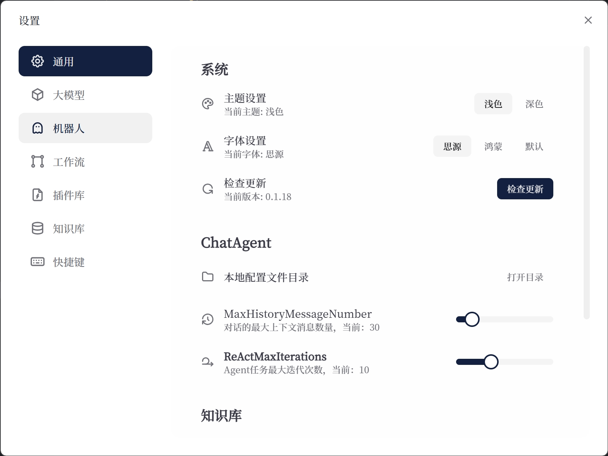

# 工作流

## 节点

### BaseNode

BaseNode 是所有节点的基类。

它定义了节点的通用属性。

1. 节点名称
2. 节点类型
3. 节点 ID
4. 节点输入
5. 节点输出

### 开始节点

开始节点掌握着整个工作流的配置。

1. 输入什么
2. 如何激活:

   1. 时间
   2. 事件（监听什么）

3. 激活后做什么

### 结束节点

结束节点是工作流的最后一个节点，它标志着工作流的结束。

结束节点可以返回一个值。

所以，工作流应该是:

```typescript
new Workflow<Input, Output>();
```

### 节点

节点是工作流中的一个步骤。


